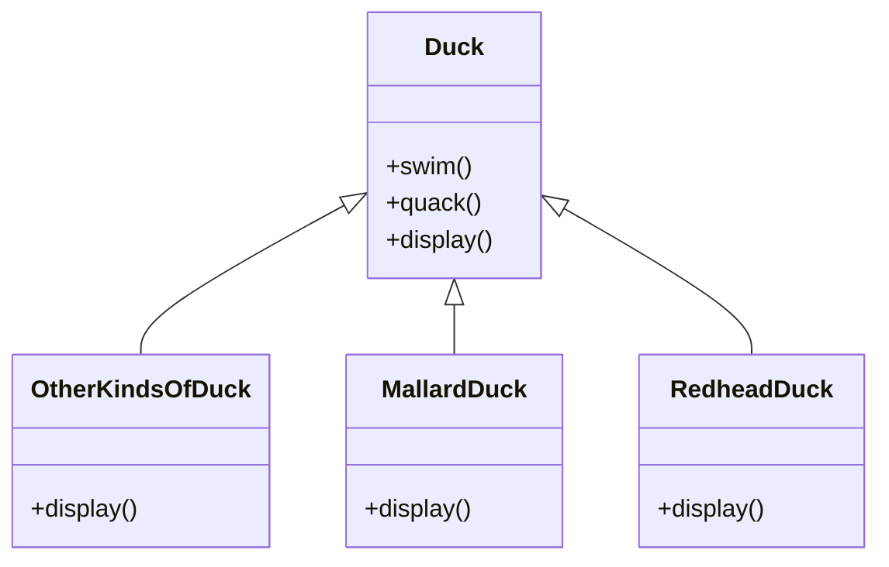
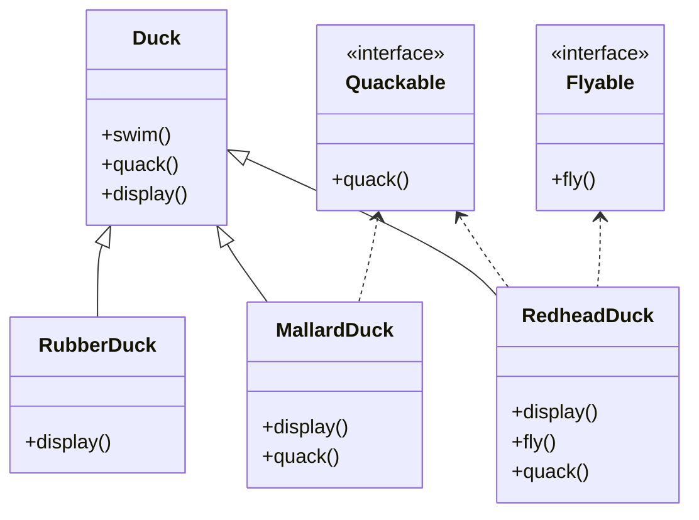
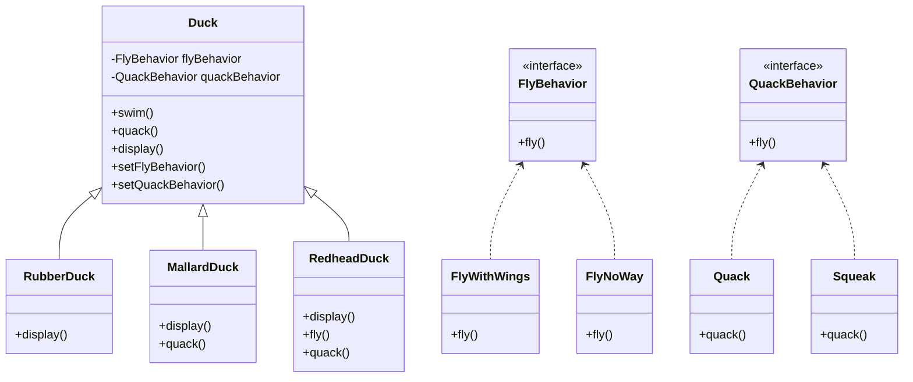
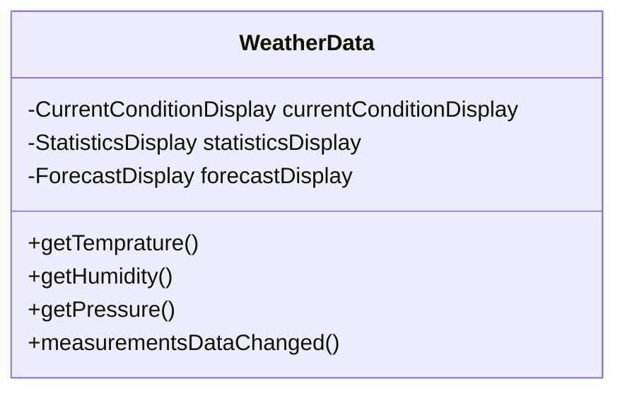
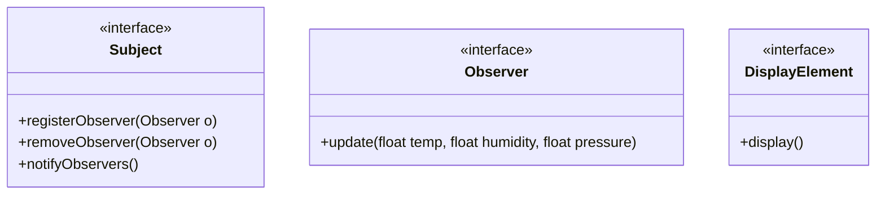
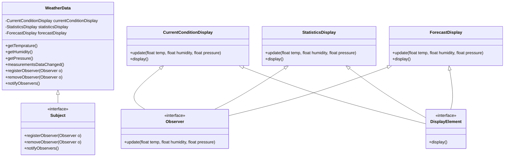
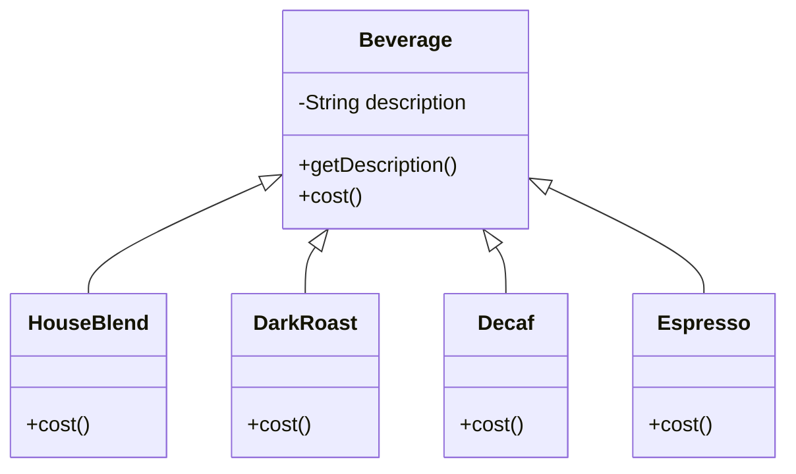
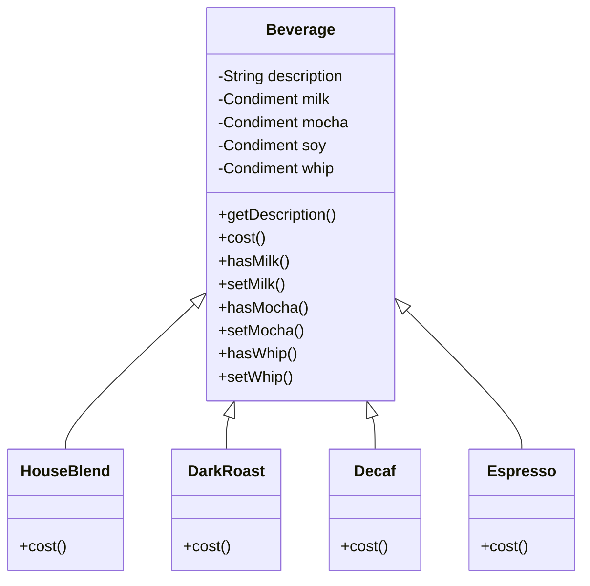
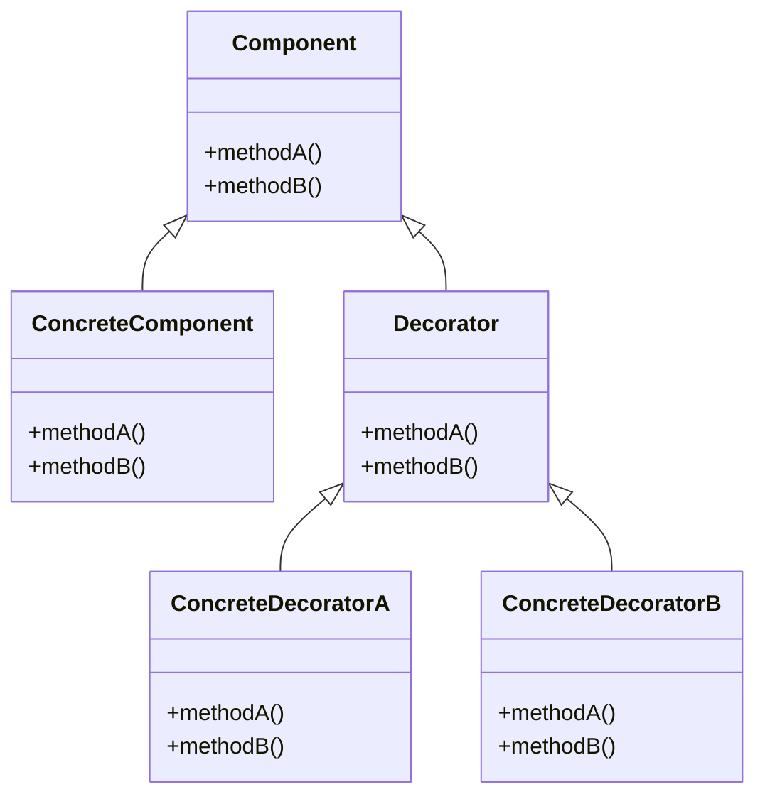
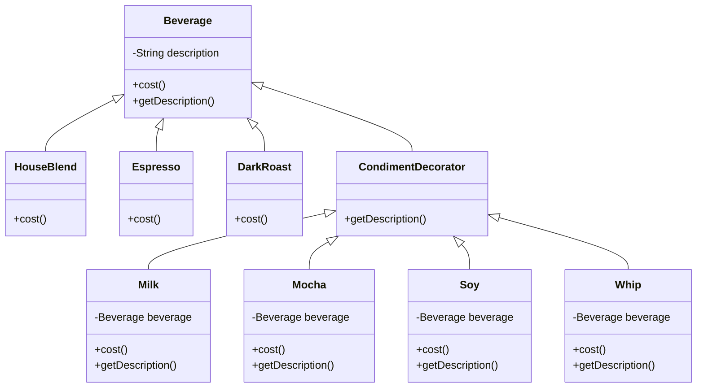

# design-pattern-practice
Practice notes for problems and solutions learned from Head First Design Pattern book


# Strategy Pattern:

**Get started:** Write a program to display a Duck and other kinds of duck. Basic action that a duck can perform is swim, quack and display

**Naive approach:** Use OO basics like Inheritance, create a Duck then other kinds of duck inherits attributes, method and override it if needed.

The class diagram looks like:




**What if ..? :**
- The customer wants to add a Rubber Duck.  It's ok, just override all the methods then leave it empty
- The customer wants to add new action to a duck, like fly. We can add fly method to Duck class, and we forget to override this method in 33 subclass of Duck that can not fly. Big problem here!
- The customer wants different duck to quack differently, We have to override quack in every Duck subclass?

**Another approach:**
- Use Interface `Quackable` and `Flyable`. Which type of duck can flly or quack can implement from theese interfaces but this is still not a good approach.
- This approach looks good at first, but not good for mantainance. When we need to modify a behavior, we need to track and change it in all subclasses, this can lead to new bug.



<!-- [](https://mermaid-js.github.io/mermaid-live-editor/edit/#eyJjb2RlIjoiY2xhc3NEaWFncmFtXG4gICAgRHVjayA8fC0tIFJ1YmJlckR1Y2tcbiAgICBEdWNrIDx8LS0gTWFsbGFyZER1Y2tcbiAgICBEdWNrIDx8LS0gUmVkaGVhZER1Y2tcbiAgICAgICAgUXVhY2thYmxlIDwuLiBSZWRoZWFkRHVja1xuICAgIFF1YWNrYWJsZSA8Li4gTWFsbGFyZER1Y2tcblxuICAgIGNsYXNzIER1Y2t7XG4gICAgICArc3dpbSgpXG4gICAgICArcXVhY2soKVxuICAgICAgK2Rpc3BsYXkoKVxuICAgIH1cbiAgICBjbGFzcyBSdWJiZXJEdWNre1xuICAgICAgICArZGlzcGxheSgpXG4gICAgfVxuICAgIGNsYXNzIE1hbGxhcmREdWNre1xuICAgICAgICArZGlzcGxheSgpXG4gICAgICAgICtxdWFjaygpXG4gICAgfVxuICAgIGNsYXNzIFJlZGhlYWREdWNre1xuICAgICAgICArZGlzcGxheSgpXG4gICAgICAgICtmbHkoKVxuICAgICAgICArcXVhY2soKVxuICAgIH1cblxuICAgIGNsYXNzIFF1YWNrYWJsZXtcbiAgICAgICAgPDxpbnRlcmZhY2U-PlxuICAgICAgICArcXVhY2soKVxuICAgIH1cblxuICAgIEZseWFibGUgPC4uIFJlZGhlYWREdWNrXG4gICAgY2xhc3MgRmx5YWJsZXtcbiAgICAgICAgPDxpbnRlcmZhY2U-PlxuICAgICAgICArZmx5KClcbiAgICB9XG4iLCJtZXJtYWlkIjoie1xuICBcInRoZW1lXCI6IFwiZGVmYXVsdFwiXG59IiwidXBkYXRlRWRpdG9yIjpmYWxzZSwiYXV0b1N5bmMiOnRydWUsInVwZGF0ZURpYWdyYW0iOmZhbHNlfQ) -->

**Efficient approach:**
- We will delegate our Duck methods to another class, and interface so that our program would be less code reuse but, more flexible and maintainable (Following some Design Principles noted at the end of this section)
- Create interfaces for behaviors like FlyBehavior, QuackBehavior. Then for each specific behavior, we create a class that implements the interface. Next, add a reference of each behavior inside a kind of Duck.
- Our final result:




**Conclusion:**
- **The Strategy Pattern** defines a family of algorithms,encapsulates each one, and makes them interchangeable.Strategy lets the algorithm vary independently from clients that use it

# Observer Pattern:
**Get started:** Given that we need to write a Weather monitor application. In this application, we have to get data from a provider. The important thing is that, we need to notify to all users whenver the forecase measurement data is updated. And also we need to display it with in multiple forms.

**Naive approach:** So first of all, we need a class contains the data and some methods to get and display data to the user. The class would look like:



And our `measurementsDataChanged` method would look something like:

```java
public void measurementsDataChanged() {
    float temp = getTemperature()
    float humidity = getHumidity()
    float pressure = getPressure()
    
    currentConditionDisplay.update(temp, humidity, pressure)
    statisticsDisplay.update(temp, humidity, pressure)
    forecastDisplay.update(temp, humidity, pressure)
}
```


**What if ..? :** 
- We need to add more display or remove one. Because the `measurementsDataChanged()` method is implemented in concrete way, we can not add or remove display withou making changes to the program

**Efficient approach:** We use Observer Pattern for this case. In this pattern, we will have a `Subject` which is our `WeatherData` class, where we get data from. The next one is `Observers`, all the thing that consume the data which is our displays
- First, we need to define all the interface needed for `Observers`, `Subjects` along with shared behavior of each observer:

- Next, refactor our `WeatherData` class:
```java
public class WeatherData implements Subject {
    private ArrayList observers;
    private float temperature;
    private float humidity;
    private float pressure;
    
    public WeatherData() {
        observers = new ArrayList();
    }
    
    public void registerObserver(Observer o) {
        observers.add(o);
    }
    
    public void removeObserver(Observer o) {
        int i = observers.indexOf(o);
        if (i >= 0) {
            observers.remove(i);
        }
    }
    
    public void notifyObservers() {
        for (int i = 0; i < observers.size(); i++) {
            Observer observer = (Observer) observers.get(i);
            observer.update(temperature, humidity, pressure);
        }
    }
    
    public void measurementsChanged() {
        notifyObservers();
    }
    public void setMeasurements(float temperature, float humidity, float pressure) {
        this.temperature = temperature;
        this.humidity = humidity;
        this.pressure = pressure;
        measurementsChanged();
    }
}
```


- Our final result:


**Conclusion:**
- **The Observer Pattern** defines a one-to-many dependency between objects so that when one object changes state, all of its dependents are notified and updated automatically

# Decorator Pattern:
**Get started:** Write a program to for a coffee shop to create order with many beverages, of course, many toppings and other properties are added onto each beverage.

**Naive approach:** Create an abstract class called Beverage, and other kind will extends this class. Then just override methods like cost() to calculate the price for each kind of beverage.

The class diagram looks like:


**What if ..? :**
- We want to add some condiments like milk, chocolate, then we just need to create more class for this kind of "new" beverage. Maybe for current Coffee type, we would have new classes such as CoffeeWithMilk, CoffeeWithSoy,..**uh oh Class Explosion**
- We calculate the price for each beverage, with different condiments, size

**Another approach:** 
- Put all the condiments inside the abstract Beverage class, then for each subclass, we have to override all the checking condiments method as below. This is still not a good approach


- Our `cost()` method in `Beverage` class would look like:
```java
public double cost() {
    double condimentCost = 0.0
    if (hasMilk()) {
        condimentCost += milk.getCost()
    }
    
    if (hasMocha()) {
        coondimentCost += mocha.getCost()
    }
    return condimentCost
}
```

- OUr `cost()` method in concreate class lets say `DarkRoast` would loook like:

```java
public double cost() {
    return 1.99 + super.cost()
}
```

**Efficient approach:** WE will use the Decorator Pattern. The core concept of this pattern would look like:

- When we apply to our current design, it would look like:


- Here is how we actually use this pattern in code:

```java
public abstract class Beverage {
    String description = “Unknown Beverage”;
    public String getDescription() {
        return description;
    }
    public abstract double cost();
}

public abstract class CondimentDecorator extends Beverage {
    public abstract String getDescription();
}
```
- Our concrete beverages:
```java
public class Espresso extends Beverage {
    public Espresso() {
        description = “Espresso”;
    }
    public double cost() {
        return 1.99;
    }
}
```

```java
public class HouseBlend extends Beverage {
    public HouseBlend() {
        description = “House Blend Coffee”;
    }
    public double cost() {
        return .89;
    }
}
```
- Our condiment decorator
```java
public class Mocha extends CondimentDecorator {
    Beverage beverage;
    public Mocha(Beverage beverage) {
        this.beverage = beverage;
    }
    public String getDescription() {
        return beverage.getDescription() + “, Mocha”;
    }
    public double cost() {
        return .20 + beverage.cost();
    }
}
```
- And finally how we decorate objects in runtime:
```java
    public static void main(String args[]) {
        Beverage beverage = new Espresso();
        System.out.println(beverage.getDescription() +
            “$” + beverage.cost());
        Beverage beverage2 = new DarkRoast();
        beverage2 = new Mocha(beverage2);
        beverage2 = new Mocha(beverage2);
        beverage2 = new Whip(beverage2);
        System.out.println(beverage2.getDescription() +
            “$” + beverage2.cost());
        Beverage beverage3 = new HouseBlend();
        beverage3 = new Soy(beverage3);
        beverage3 = new Mocha(beverage3);
        beverage3 = new Whip(beverage3);
        System.out.println(beverage3.getDescription() +
            “$” + beverage3.cost());
    }
```
- The output looks like:

```
Espresso $1.99
Dark Roast Coffee, Mocha, Mocha, Whip $1.49
House Blend Coffee, Soy, Mocha, Whip $1.34
```
# Factory Pattern:
- Simple Factory
- Factory Method
- Abstract Factory
**Get started:** 

**Naive approach:** 

The class diagram looks like:

**What if ..? :**
**Another approach:**

**Efficient approach:**

- Our final result:


**Conclusion:**
- **The Factory Pattern** 

# Builder Pattern:
**Get started:** 

**Naive approach:** 

The class diagram looks like:

**What if ..? :**
**Another approach:**

**Efficient approach:**

- Our final result:


**Conclusion:**
- **The Builder Pattern** 


