# design-pattern-practice
Practice notes for problems and solutions learned from Head First Design Pattern book

 [](https://github.com/)


<div id='top'/> 

*******
Tables of contents  
 1. [Strategy Pattern](#strategypattern)
 2. [Observer Pattern](#observerpattern)
 3. [Decorator Pattern](#decoratorpattern)
 4. [Factory Pattern](#factorypattern)
 5. [Singleton Pattern](#singletonpattern)
 6. [Command Pattern](#commandpattern)

*******
[Jump to end](#theend)
<div id='strategypattern'/> 

# Strategy Pattern:

**Get started:** Write a program to display a Duck and other kinds of duck. Basic action that a duck can perform is swim, quack and display

**Naive approach:** Use OO basics like Inheritance, create a Duck then other kinds of duck inherits attributes, method and override it if needed.

The class diagram looks like:

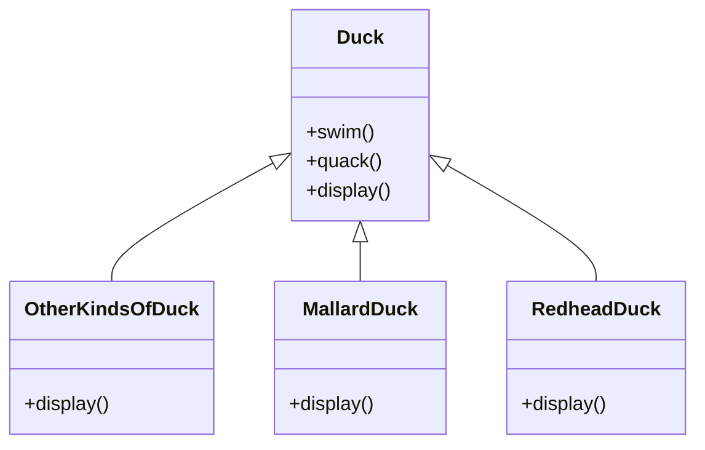


**What if ..? :**
- The customer wants to add a Rubber Duck.  It's ok, just override all the methods then leave it empty
- The customer wants to add new action to a duck, like fly. We can add fly method to Duck class, and we forget to override this method in 33 subclass of Duck that can not fly. Big problem here!
- The customer wants different duck to quack differently, We have to override quack in every Duck subclass?

**Another approach:**
- Use Interface `Quackable` and `Flyable`. Which type of duck can flly or quack can implement from theese interfaces but this is still not a good approach.
- This approach looks good at first, but not good for mantainance. When we need to modify a behavior, we need to track and change it in all subclasses, this can lead to new bug.

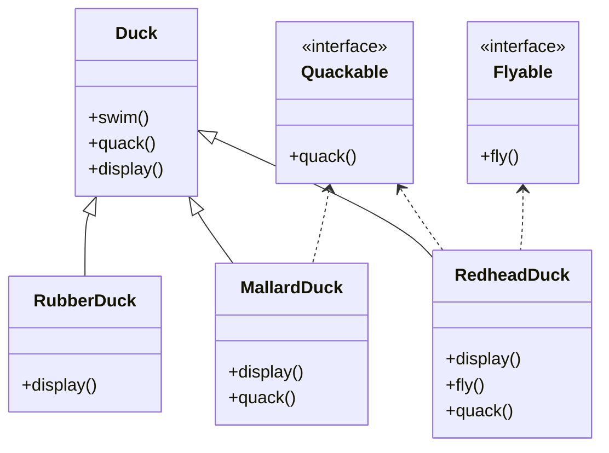

<!-- [](https://mermaid-js.github.io/mermaid-live-editor/edit/#eyJjb2RlIjoiY2xhc3NEaWFncmFtXG4gICAgRHVjayA8fC0tIFJ1YmJlckR1Y2tcbiAgICBEdWNrIDx8LS0gTWFsbGFyZER1Y2tcbiAgICBEdWNrIDx8LS0gUmVkaGVhZER1Y2tcbiAgICAgICAgUXVhY2thYmxlIDwuLiBSZWRoZWFkRHVja1xuICAgIFF1YWNrYWJsZSA8Li4gTWFsbGFyZER1Y2tcblxuICAgIGNsYXNzIER1Y2t7XG4gICAgICArc3dpbSgpXG4gICAgICArcXVhY2soKVxuICAgICAgK2Rpc3BsYXkoKVxuICAgIH1cbiAgICBjbGFzcyBSdWJiZXJEdWNre1xuICAgICAgICArZGlzcGxheSgpXG4gICAgfVxuICAgIGNsYXNzIE1hbGxhcmREdWNre1xuICAgICAgICArZGlzcGxheSgpXG4gICAgICAgICtxdWFjaygpXG4gICAgfVxuICAgIGNsYXNzIFJlZGhlYWREdWNre1xuICAgICAgICArZGlzcGxheSgpXG4gICAgICAgICtmbHkoKVxuICAgICAgICArcXVhY2soKVxuICAgIH1cblxuICAgIGNsYXNzIFF1YWNrYWJsZXtcbiAgICAgICAgPDxpbnRlcmZhY2U-PlxuICAgICAgICArcXVhY2soKVxuICAgIH1cblxuICAgIEZseWFibGUgPC4uIFJlZGhlYWREdWNrXG4gICAgY2xhc3MgRmx5YWJsZXtcbiAgICAgICAgPDxpbnRlcmZhY2U-PlxuICAgICAgICArZmx5KClcbiAgICB9XG4iLCJtZXJtYWlkIjoie1xuICBcInRoZW1lXCI6IFwiZGVmYXVsdFwiXG59IiwidXBkYXRlRWRpdG9yIjpmYWxzZSwiYXV0b1N5bmMiOnRydWUsInVwZGF0ZURpYWdyYW0iOmZhbHNlfQ) -->

**Efficient approach:**
- We will delegate our Duck methods to another class, and interface so that our program would be less code reuse but, more flexible and maintainable (Following some Design Principles noted at the end of this section)
- Create interfaces for behaviors like FlyBehavior, QuackBehavior. Then for each specific behavior, we create a class that implements the interface. Next, add a reference of each behavior inside a kind of Duck.
- Our final result:

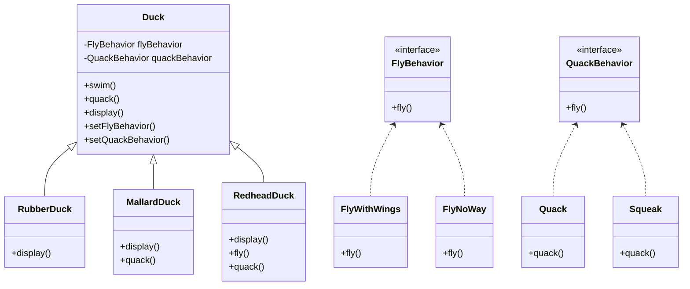


**Conclusion:**
- **The Strategy Pattern** defines a family of algorithms,encapsulates each one, and makes them interchangeable.Strategy lets the algorithm vary independently from clients that use it

[Back to top](#top)

<div id='observerpattern'/> 

# Observer Pattern:
**Get started:** Given that we need to write a Weather monitor application. In this application, we have to get data from a provider. The important thing is that, we need to notify to all users whenver the forecase measurement data is updated. And also we need to display it with in multiple forms.

**Naive approach:** So first of all, we need a class contains the data and some methods to get and display data to the user. The class would look like:

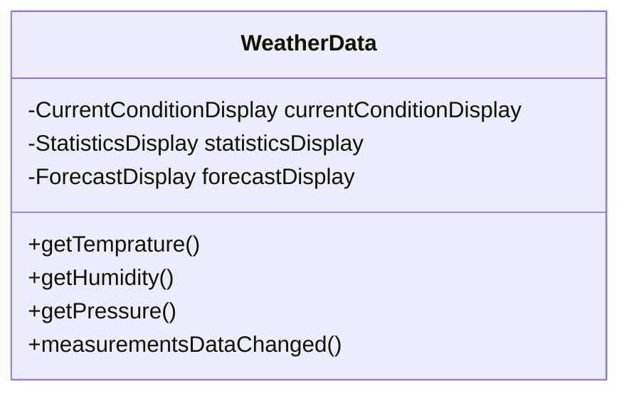

And our `measurementsDataChanged` method would look something like:

```java
public void measurementsDataChanged() {
    float temp = getTemperature()
    float humidity = getHumidity()
    float pressure = getPressure()
    
    currentConditionDisplay.update(temp, humidity, pressure)
    statisticsDisplay.update(temp, humidity, pressure)
    forecastDisplay.update(temp, humidity, pressure)
}
```


**What if ..? :** 
- We need to add more display or remove one. Because the `measurementsDataChanged()` method is implemented in concrete way, we can not add or remove display withou making changes to the program

**Efficient approach:** We use Observer Pattern for this case. In this pattern, we will have a `Subject` which is our `WeatherData` class, where we get data from. The next one is `Observers`, all the thing that consume the data which is our displays
- First, we need to define all the interface needed for `Observers`, `Subjects` along with shared behavior of each observer:
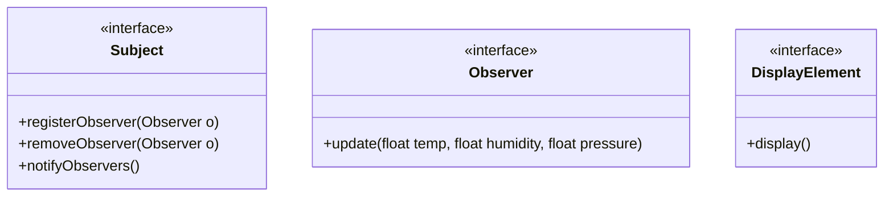
- Next, refactor our `WeatherData` class:
```java
public class WeatherData implements Subject {
    private ArrayList observers;
    private float temperature;
    private float humidity;
    private float pressure;
    
    public WeatherData() {
        observers = new ArrayList();
    }
    
    public void registerObserver(Observer o) {
        observers.add(o);
    }
    
    public void removeObserver(Observer o) {
        int i = observers.indexOf(o);
        if (i >= 0) {
            observers.remove(i);
        }
    }
    
    public void notifyObservers() {
        for (int i = 0; i < observers.size(); i++) {
            Observer observer = (Observer) observers.get(i);
            observer.update(temperature, humidity, pressure);
        }
    }
    
    public void measurementsChanged() {
        notifyObservers();
    }
    public void setMeasurements(float temperature, float humidity, float pressure) {
        this.temperature = temperature;
        this.humidity = humidity;
        this.pressure = pressure;
        measurementsChanged();
    }
}
```


- Our final result:


**Conclusion:**
- **The Observer Pattern** defines a one-to-many dependency between objects so that when one object changes state, all of its dependents are notified and updated automatically

[Back to top](#top)

<div id='decoratorpattern'/>

# Decorator Pattern:
**Get started:** Write a program to for a coffee shop to create order with many beverages, of course, many toppings and other properties are added onto each beverage.

**Naive approach:** Create an abstract class called Beverage, and other kind will extends this class. Then just override methods like cost() to calculate the price for each kind of beverage.

The class diagram looks like:
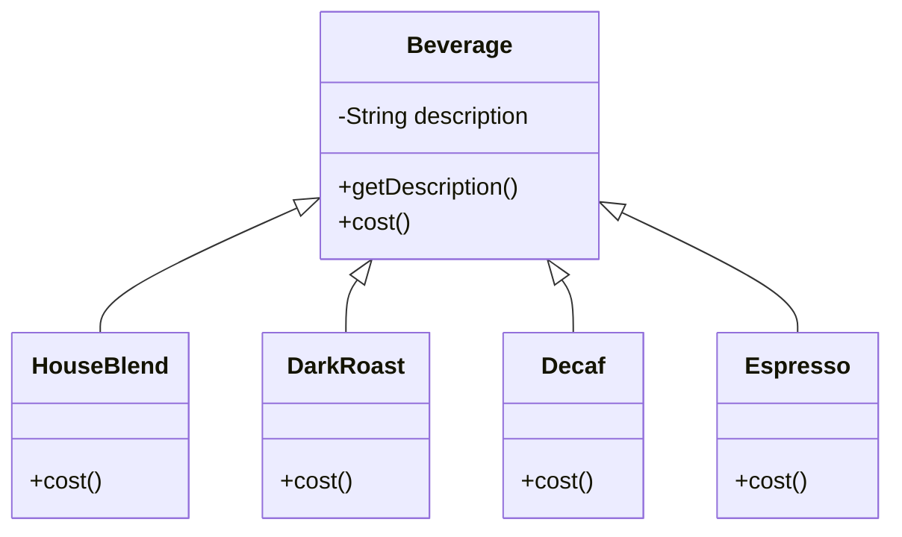

**What if ..? :**
- We want to add some condiments like milk, chocolate, then we just need to create more class for this kind of "new" beverage. Maybe for current Coffee type, we would have new classes such as CoffeeWithMilk, CoffeeWithSoy,..**uh oh Class Explosion**
- We calculate the price for each beverage, with different condiments, size

**Another approach:** 
- Put all the condiments inside the abstract Beverage class, then for each subclass, we have to override all the checking condiments method as below. This is still not a good approach

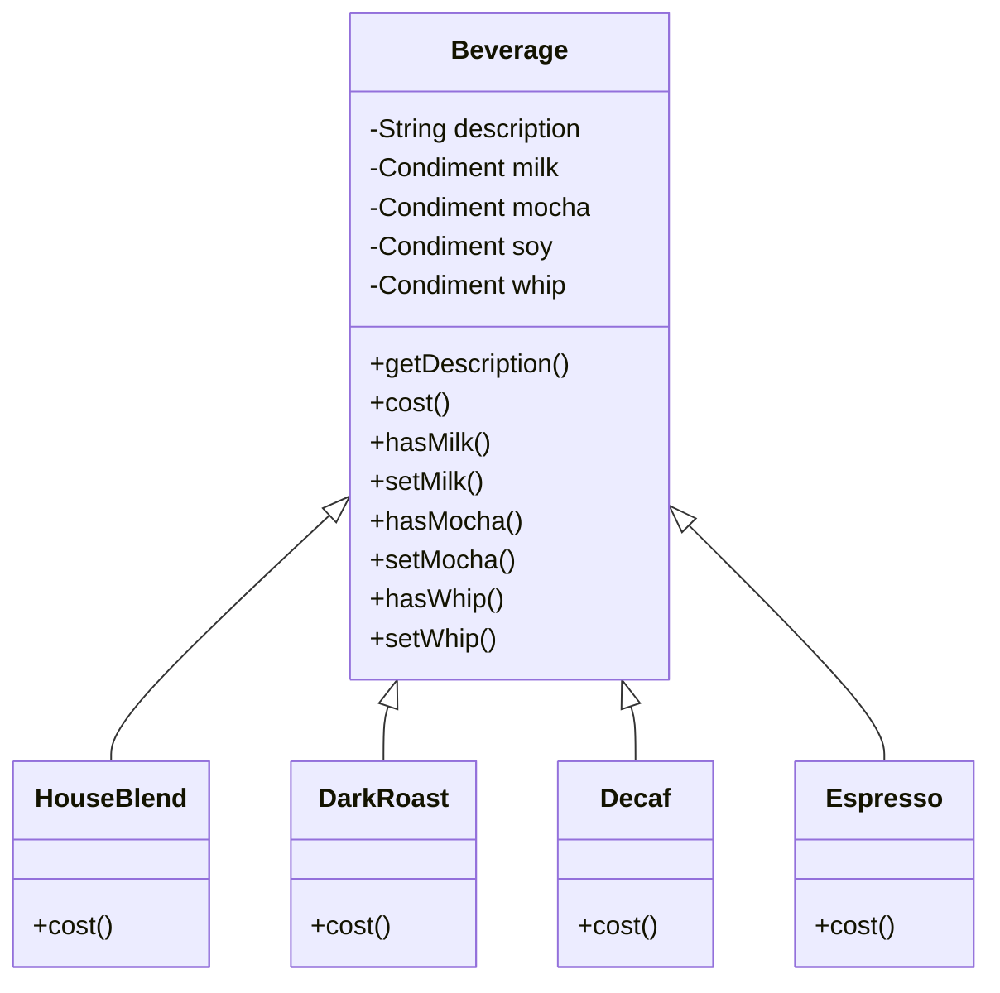
- Our `cost()` method in `Beverage` class would look like:
```java
public double cost() {
    double condimentCost = 0.0
    if (hasMilk()) {
        condimentCost += milk.getCost()
    }
    
    if (hasMocha()) {
        coondimentCost += mocha.getCost()
    }
    return condimentCost
}
```

- OUr `cost()` method in concreate class lets say `DarkRoast` would loook like:

```java
public double cost() {
    return 1.99 + super.cost()
}
```

**Efficient approach:** WE will use the Decorator Pattern. The core concept of this pattern would look like:
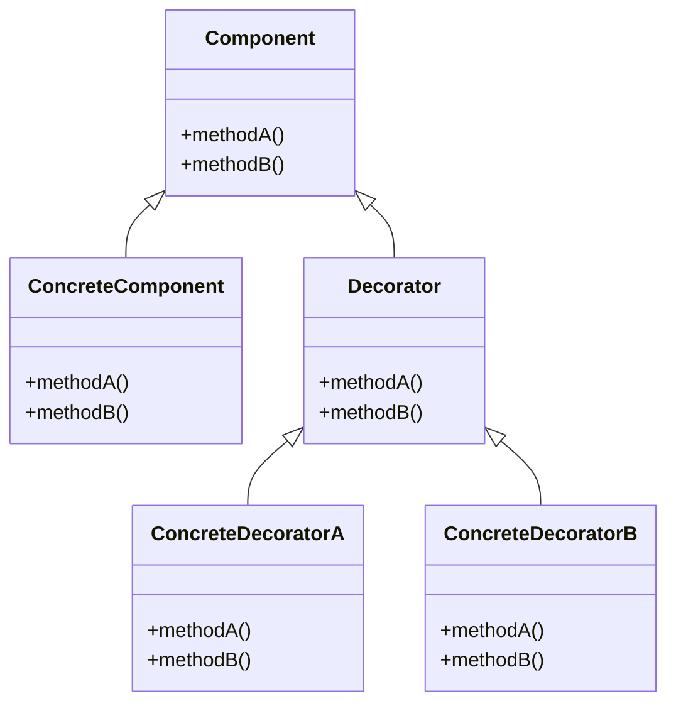
- When we apply to our current design, it would look like:
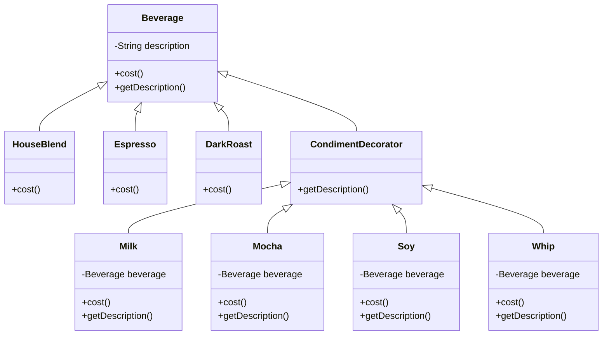

- Here is how we actually use this pattern in code:

```java
public abstract class Beverage {
    String description = “Unknown Beverage”;
    public String getDescription() {
        return description;
    }
    public abstract double cost();
}

public abstract class CondimentDecorator extends Beverage {
    public abstract String getDescription();
}
```
- Our concrete beverages:
```java
public class Espresso extends Beverage {
    public Espresso() {
        description = “Espresso”;
    }
    public double cost() {
        return 1.99;
    }
}
```

```java
public class HouseBlend extends Beverage {
    public HouseBlend() {
        description = “House Blend Coffee”;
    }
    public double cost() {
        return .89;
    }
}
```
- Our condiment decorator
```java
public class Mocha extends CondimentDecorator {
    Beverage beverage;
    public Mocha(Beverage beverage) {
        this.beverage = beverage;
    }
    public String getDescription() {
        return beverage.getDescription() + “, Mocha”;
    }
    public double cost() {
        return .20 + beverage.cost();
    }
}
```
- And finally how we decorate objects in runtime:
```java
    public static void main(String args[]) {
        Beverage beverage = new Espresso();
        System.out.println(beverage.getDescription() +
            “$” + beverage.cost());
        Beverage beverage2 = new DarkRoast();
        beverage2 = new Mocha(beverage2);
        beverage2 = new Mocha(beverage2);
        beverage2 = new Whip(beverage2);
        System.out.println(beverage2.getDescription() +
            “$” + beverage2.cost());
        Beverage beverage3 = new HouseBlend();
        beverage3 = new Soy(beverage3);
        beverage3 = new Mocha(beverage3);
        beverage3 = new Whip(beverage3);
        System.out.println(beverage3.getDescription() +
            “$” + beverage3.cost());
    }
```
- The output looks like:

```
Espresso $1.99
Dark Roast Coffee, Mocha, Mocha, Whip $1.49
House Blend Coffee, Soy, Mocha, Whip $1.34
```

[Back to top](#top)

<div id='factorypattern'/>

# Factory Pattern:
- Simple Factory
- Factory Method
- Abstract Factory

**Get started:** Write a program to support a pizza shop make their order process mroe smooth. This program supports creating many types of Pizza and be able to customized based on branches.


**Naive approach:** As usual, we will come up with a `orderPizza` function like this, because to order a pizza, we need some mroe steps like prepare, bake, cut,... so we have:

```java
Pizza orderPizza(){
    Pizza pizza = new Pizza();
    
    pizza.perpare();
    pizza.bake();
    pizze,cut();
    pizza.box();
    return pizza;
}
```

The class diagram looks like:

**What if ..? :**
- We need to add more pizze types. Then our `orderPizza` becomes:
```java
Pizza orderPizza(String type){
    Pizza pizza;
    
    if (type.equals("cheese") pizza = new CheesePizza();
    else if (type.equals("geekl") pizza = new GeekPizza();
    else if (type.equals("cheese") pizza = new CheesePizza();
    else if (type.equals("clam") pizza = new ClamPizza();

    pizza.perpare();
    pizza.bake();
    pizze,cut();
    pizza.box();
    return pizza;
}
```

**Another approach:**
- We can improve the code inside `orderPizza` function. AS you can see, we can separate the code for creating a pizza based on its type. Put the creation code to a separated class, and we have a simple factory. **This is not actually a Design Pattern but commonly used**
```java
public class SimplePizzaFactory {

    public Pizza createPizza(String type) {
        Pizza pizza;
    
        if (type.equals("cheese") pizza = new CheesePizza();
        else if (type.equals("geekl") pizza = new GeekPizza();
        else if (type.equals("cheese") pizza = new CheesePizza();
        else if (type.equals("clam") pizza = new ClamPizza();

        return pizza; 
    }
}
```

- The code for the PizzaStore class would look like:

```java
public class PizzaStore {
    SimplePizzaFactory factory;
    public PizzaStore(SimplePizzaFactory factory) {
        this.factory = factory;
    }
    public Pizza orderPizza(String type) {
        Pizza pizza;
        
        pizza = factory.createPizza(type);
        pizza.perpare();
        pizza.bake();
        pizze,cut();
        pizza.box();
        
        return pizza;
    }
    
}
```
- The class diagram looks like:

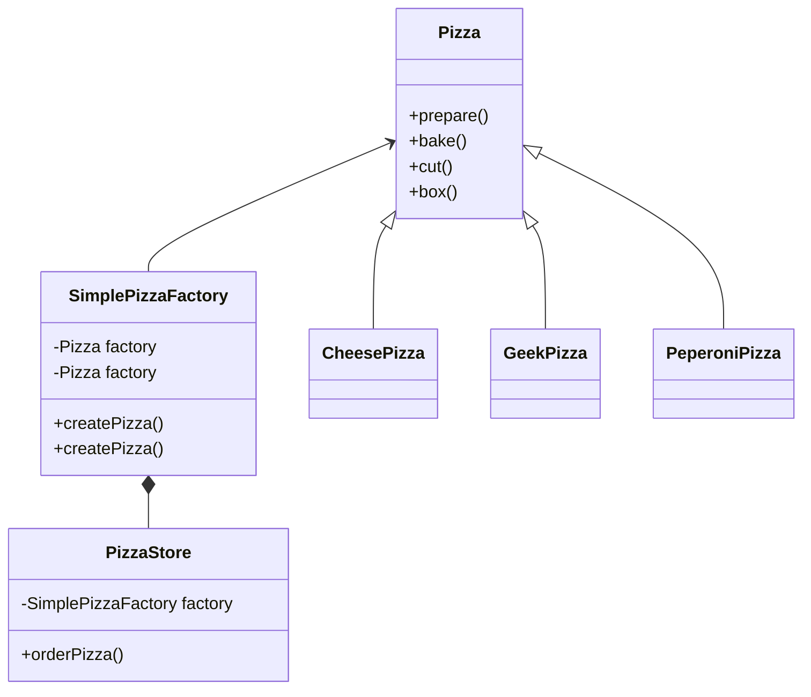
**Problem occurs:**
- When we need to fanchise our PizzaStore to many places with many different types of Pizza. For example. New York style pizza, Chicago style Pizza. Now we need to build a framework to create the right type of pizza and also keep our process smooth. Because our Pizza Store is already stable.
- A naive approach is that we can create factory object for each fanchise. For example: NYPizzaFactory, ChicagoPizzaFactory and whenever we need, just `new NYPizzaFactory()`

**Better approach** 
- Make our PizzaStore class and the `createPizza` method  `abstract` as well. Because our ordering process is stable so we just keep it as usual. If you want every fanchise has the same process, make it `final`.
- Implement orderPizze method 
- Create other franchise pizza factory by subclass from PizzaStore, and override the createPizza method. Because our createrPizze is abstract, we force all concreate class override it and let subclass decide what type of pizza they create.
The code:
```java
public abstract class PizzaStore {
    public Pizza orderPizza(String type) {
        Pizza pizza;
        
        pizza = factory.createPizza(type);
        pizza.perpare();
        pizza.bake();
        pizze,cut();
        pizza.box();
        
        return pizza;
    }
    
    abstract Pizza createPizza(String type);
    
}
```

- Class diagram for franchise would look like:

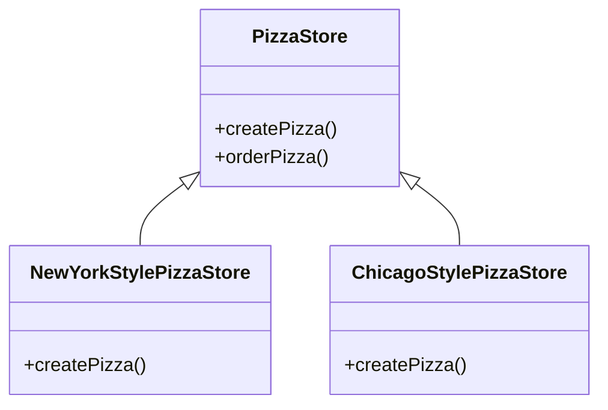
- In each subclass of PizzaStore, let's say ChicagoStylePizzaStore, the `createPizze` method would look like:

```java
public class ChicagoStylePizzaStore extends PizzaStore {
  Pizza createPizza(String item) {
    if (item.equals(“cheese”)) {
      return new NYStyleCheesePizza();
    } else if (item.equals(“veggie”)) {
      return new NYStyleVeggiePizza();
    } else if (item.equals(“clam”)) {
      return new NYStyleClamPizza();
    } else if (item.equals(“pepperoni”)) {
      return new NYStylePepperoniPizza();
    } else return null;
  }
}
```
The `createPizza` method above is called Factory method. Which is:
- Abstract so that the subclass is counted to handle object creation
- Returns data type used within methods declare in the superclass
- Isolates the code in superclass from knowing what kind of object is actually created

**Efficient approach:** Currently, our Pizza Store is fine. However, it is very hard to keep the ingredients of the pizza in every store at different regions the same. For example, the New Your store would use another ingredients for the tomato sauce, the Chicago store also do so. This is when we need to do something to make our ingredients set more flexible across region.
Because of the fact that New York would use one set of ingredients, Chicago would use another. It's time we need to create families of ingredients.
First, we need to create an IngredientsFactory to create each set of ingredients. If our stores in every region have the same behavior, consider using an `abstract` class. In this case, an `interface` is good enough. Our shared factory would look like:

```java
public interface PizzaIngredientFactory {
    public Dough createDough();
    public Sauce createSauce();
    public Cheese createCheese();
    public Veggies[] createVeggies();
    public Pepperoni createPepperoni();
    public Clams createClam();
}
```
Next, we need to:
- Build factory for each region
- Implement set of ingredients class to be used with the factory
- Hook the new factories to current Pizza Store 

Let's take the New York style for an example:
```java
public class NYPizzaIngredientFactory implements PizzaIngredientFactory {
    public Dough createDough() {
        return new ThinCrustDough();
    }
    public Sauce createSauce() {
        return new MarinaraSauce();
    }
    public Cheese createCheese() {
        return new ReggianoCheese();
    }
    public Veggies[] createVeggies() {
        Veggies veggies[] = {
            new Garlic(),
            new Onion(),
            new Mushroom(),
            new RedPepper()
        };
        return veggies;
    }
    public Pepperoni createPepperoni() {
        return new SlicedPepperoni();
    }
    public Clams createClam() {
        return new FreshClams();
    }
}
```
Remember that all the classed that being created should be the concrete class of the return type :)
After that, our Pizza class becomes:

```java
public abstract class Pizza {
    String name;
    Dough dough;
    Sauce sauce;
    Veggies veggies[];
    Cheese cheese;
    Pepperoni pepperoni;
    Clams clam;
    abstract void prepare();
    void bake() {
        System.out.println(“Bake for 25 minutes at 350”);
    }
    void cut() {
        System.out.println(“Cutting the pizza into diagonal slices”);
    }
    void box() {
        System.out.println(“Place pizza in official PizzaStore box”);
    }
}
```
Now that we have an abstraction of Pizza. So clean! Let's take a look on it's concrete classes:
```java
public class CheesePizza extends Pizza {
    PizzaIngredientFactory ingredientFactory;
    public CheesePizza(PizzaIngredientFactory ingredientFactory) {
        this.ingredientFactory = ingredientFactory;
    }
    void prepare() {
        System.out.println(“Preparing“ + name);
        dough = ingredientFactory.createDough();
        sauce = ingredientFactory.createSauce();
        cheese = ingredientFactory.createCheese();
    }
}


public class ClamPizza extends Pizza {
    PizzaIngredientFactory ingredientFactory;
    public ClamPizza(PizzaIngredientFactory ingredientFactory) {
        this.ingredientFactory = ingredientFactory;
    }
    void prepare() {
        System.out.println(“Preparing“ + name);
        dough = ingredientFactory.createDough();
        sauce = ingredientFactory.createSauce();
        cheese = ingredientFactory.createCheese();
        clam = ingredientFactory.createClam();
    }
}

```


**Conclusion:**
- **The Factory Method Pattern**: defines an interface for creating object but let subclass decide which class to instantiate.
- **Dependency Inversion Principle**: depends uppon abstractions. Do not depend on concrete classes

> **Note**: Guildline to follow Dependency Inversion Principle:
> - No variable should hold a reference to a concrete class (If use `new`, which means holding a reference to concrete class. Should delegate to a factory)
> - No class should derive from concrete class (If we derive from concrete class, we depends on it. Only depends on abstractions like abstract class or interface)
> - No method should override implemented method of base class (If we override implemented method, the base class wasn't really an abstraction anymore. Those implemented methods are meant to be shared by all subclasses)

[Back to top](#top)

<div id='singletonpattern'/> 

# Singleton Pattern:
**Get started:** We need to create an object to be used everywhere. Make sure this object is one-of-a-kind.

**Naive approach:** Create a class as the diagram below. Because we only need our object is only initialized when we need it, then we check null before returning initialize it. So simple:
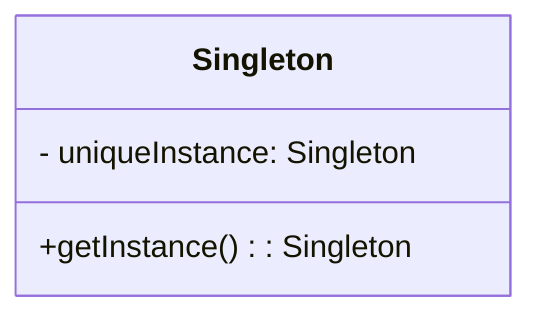

```java
public class Singleton {
    private static Singleton uniqueInstance;
    // other useful instance variables here
    private Singleton() {}
    public static Singleton getInstance() {
        if (uniqueInstance == null) {
            uniqueInstance = new Singleton();
        }
        return uniqueInstance;
    }
    // other useful methods here
}
```
**Problem occurs:**
- What if we have more than one place use the singleton at the same time? More than one thread access to properties of the Singleton.
- How do we handle this case? Some threads would have some conditions for the properties from Singleton to make the program run properly. Value of a property might be modified by a process while another is about to use the previous value.
- If we do not handle this case for multi threads, it would lead to the situation where one thread always run wrongly and never give us the expected behavior

**Better approach:** We need to do something to make sure that 'if a thread is about to access singleton, every other threads that access before should done their job'.
We can do this by using `synchronized` keyword in Java:

```java
public class Singleton {
    private static Singleton uniqueInstance;
    // other useful instance variables here
    private Singleton() {}
    public static synchronized Singleton getInstance() {
        if (uniqueInstance == null) {
            uniqueInstance = new Singleton();
        }
        return uniqueInstance;
    }
    // other useful methods here
}
```
> **Note**: The `synchronized` is only relevent by the time we initlaized the object. When we already have the object, we do not need to synchronize this method. Looks like synchronized is unnedded overhead

**Efficient approach**: We have 3 options to consider to make sure our Singleton object works properly for every cases including multithreading one.
1. Keep the `synchronized` and leave the current one as is if the object initalization is not expensive to your application
2. Move to an eagerly created instance rather than a lazily one. 
Using this approach, we rely on the JVM to create the unique instance of the Singleton when the class is loaded. The JVM guarantees that the instance will be created before any thread accesses the static uniqueInstance variable
```java
public class Singleton {
    private static Singleton uniqueInstance = new Singleton();
    private Singleton() {}
    public static Singleton getInstance() {
        return uniqueInstance;
    }
}
```
3. Use “double-checked locking” to reduce the use of synchronization in getInstance()
With double-checked locking, we first check to see if an instance is created, and if not, THEN we
synchronize. This way, we only synchronize the first time through, just what we want
```java
public class Singleton {
    private volatile static Singleton uniqueInstance;
    private Singleton() {}
    public static Singleton getInstance() {
        if (uniqueInstance == null) {
            synchronized(Singleton.class) {
                if (uniqueInstance == null) {
                    uniqueInstance = new Singleton();
                }
            }
        }
        return uniqueInstance;
    }
}
```
> **Note**: The volatile keyword ensures that multiple threads handle the uniqueInstance variable correctly when it is being initialized to the Singleton instance

**Conclusion:**
- **The Singleton Pattern** : ensures a class has only one instance, and provides a global point of access to it


[Back to top](#top)

<div id='commandpattern'/> 

# Command Pattern:
**Get started:** Given that we want to build an API to support a remote control to control our smart home devices. This API would allow the remote to interact with the classes provided by the devices vendor. In general, this control will have some slots, each slot would allow you to control a device. For each device, you can perform turn on, turn off and other actions.
The classes provided are something like:

**Initial thought**: With OO Principles in our hands, our initial though is that we should do something to make sure that the remote does not know much about the details of how to turn on or turn off a light. It should request throught another helper to make it do it.
We also need to avoid if statements like `if slot1 == Light then turnOff() else if slot1 == GarageDoor then scrollDown()`. This approach will lead to lot of changes when we need to add more devices. More work and more bugs.

**Approach:** Alright, now we have to do some thing to make the remote coltrol requests for what it want and another helper make the work done. This is quite similar to the way we request an order in restaurant. Let's take this as an example before we jump in to the pattern.
The order process looks like:
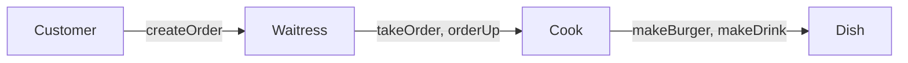
The waitress will receive order from customer, then bring it to the Cook, tell him to cook. After that, the cook will make the dishes following the list inside the order.
Back to our case, the remote control need to create requests to `another class` to execute, and inside the execute of `another class`, we will call the exact method of each class provided from vendors.
Let's take a look at this diagram:

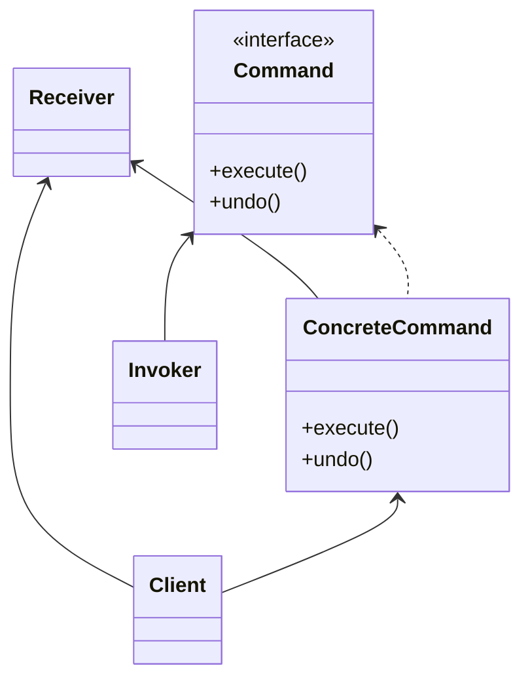
In general, this is how it works:


[Back to top](#top)

<div id='adapterandfacadepattern'/> 
# Adapter and Facade Pattern:


<div id='theend'/> 


